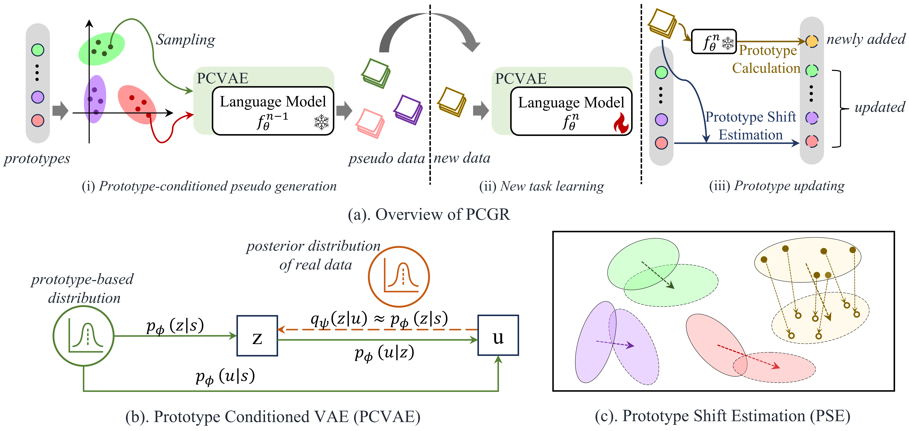

Prototype Conditioned Generative Replay for Continual Learning in NLP
=================


This repository contains code for the paper "[Prototype Conditioned Generative Replay for Continual Learning in NLP](https://aclanthology.org/2025.naacl-long.636/)".
We propose Prototype Conditioned Generative Replay (PCGR), which enhances generative reply by incorporating prototype, the task-level statistics. 
PCGR leverages a Prototype Conditioned Variational Autoencoder (PCVAE) to generate pseudo-samples that are both representative and diverse, accurately reflecting the real data distribution. 
This approach can effectively mitigates catastrophic forgetting in continual learning.





Data Preparation
-----------------
1. Define the sequential order of your tasks from which your model will continuously learn. Place the corresponding information in the file `./SnD/info.py` using the following format:
    ```
    ORDER_DICT = {   
        'order_0': ['example_task_0', 'example_task_1'],
    }
    ```

2. For each task, tasking `example_task_1` as an example (which is a subset of the intent detection task: "[banking77](https://huggingface.co/datasets/PolyAI/banking77)"), follow these steps:

    i). Organize your data in the `./datasets` folder with the following structure:
    ```
    ./datasets/
    --example_task_0/
        --train.json
        --valid.json
        --test.json
    ```

    ii). Write the corresponding "[Dataset](https://pytorch.org/tutorials/beginner/basics/data_tutorial.html)" class, place it under `./SnD/SnD_datasets`, and import the dataset in the file `./SnD/SnD_models/trainer.py`. Refer to `./SnD/SnD_datasets/cls_dataset.py` as an example.

    iii).  Add the corresponding task-specific metric in the file `./SnD/metrics.py`, and include an entry for it in the `compute_metrics` function. Refer to `compute_em` function as an example.

    iv).  Add the relevant task-specific information into the file `./SnD/info.py`, following this format:
    ```
    TASK2INFO = {   
            'example_task_0': {   
                    'dataset_class': 'PromptCLSDataset', 
                    'dataset_folder': 'example_task_0',  
                    'eval_metric': {'em'},               
                    'id': 0,                             
                    'metric': 'em',                      
                    'part_prompt': 'which intent category best describes:',
                    'task_type': 'intent'                
                },
            
        }
    IDTOTASK = {0: 'example_task_0',}

    TASKTOID = {'example_task_0': 0,}
    ```  

If you want to use the exact dataset for training and testing PCGR, please email Xi Chen.


Environment and Setup
-----------------
Experiments in this paper are run on Tesla V100 with CUDA 11.8

1. Install the experiment:
    ```
    pip install -r requirements.txt
    ```

2. Edit `./enviornment`.


Training and Testing
-----------------

```
sh ./scripts/pcgr.sh
```

Citation
-----------------

```bibtex
@inproceedings{chen-zeng-2025-prototype,
    title = "Prototype Conditioned Generative Replay for Continual Learning in {NLP}",
    author = "Chen, Xi and Zeng, Min",
    editor = "Chiruzzo, Luis and Ritter, Alan and Wang, Lu",
    booktitle = "Proceedings of the 2025 Conference of the Nations of the Americas Chapter of the Association for Computational Linguistics: Human Language Technologies (Volume 1: Long Papers)",
    month = apr,
    year = "2025",
    address = "Albuquerque, New Mexico",
    publisher = "Association for Computational Linguistics",
    url = "https://aclanthology.org/2025.naacl-long.636/",
    pages = "12754--12770",
    ISBN = "979-8-89176-189-6"
}
```

Thanks
-----------------

The code of this repository partly relies on [PCLL](https://github.com/AlibabaResearch/DAMO-ConvAI/tree/main/pcll) and I would like to show my sincere gratitude to authors of it.

Concact
-----------------
If you have any questions about our paper and code, please contact Xi Chen via chenxi.mail.1005@gmail.com.

Note
-----------------
You might find it confusing that our main code is located in the folder `./SnD`, rather than something like `PCGR`. This is because our method focuses on improving pseudo sample quality in terms of **s**emantic a**n**d **d**istribution scales. In our initial draft, we named our method **SnD** to reflect this focus.


